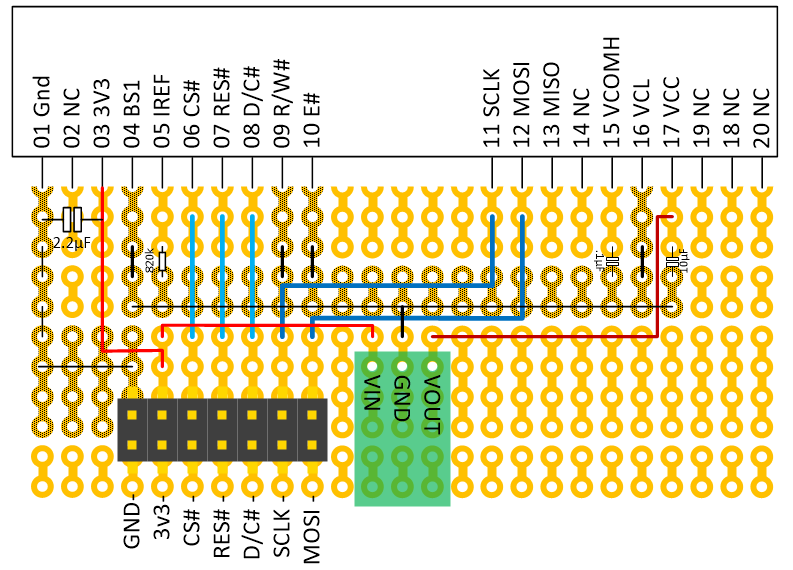
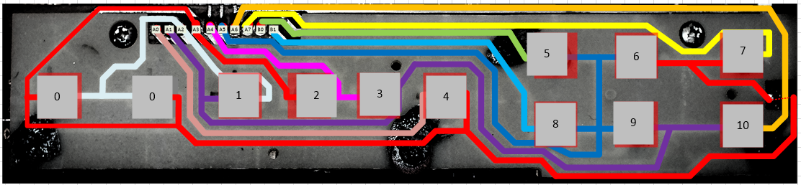
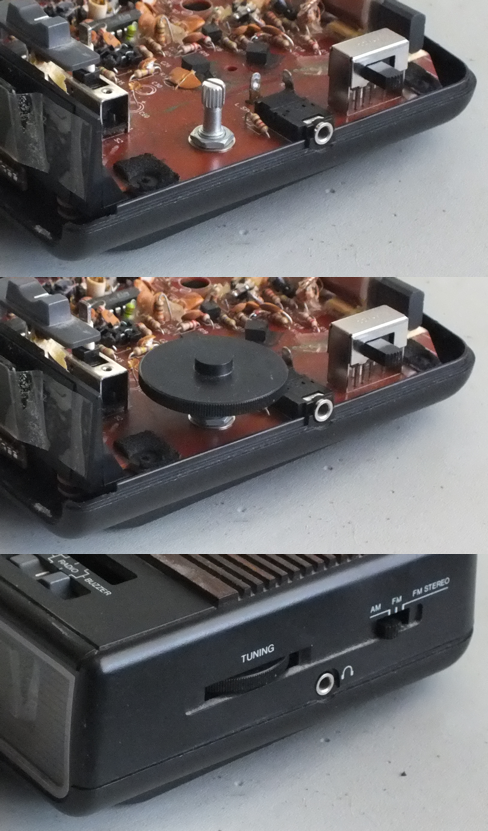

<html>
<head></head>
<body>

# DAB Clock Radio Retrofit

Inspired by a project on Hackday (<a href="http://hackaday.com/2014/09/18/sprite_tm-puts-linux-in-a-clock-radio/">Hackaday Link</a> and <a href="http://spritesmods.com/?art=clockradio&page=1">Original Source Link</a>) I replaced the internals
of my clock radio.

There were 2 problems with my aging clock radio - 1) no battery back-up after a power loss, and 2) poor radio tuning through the analog tuner.
I tried using my Samsung tablet, but it doesn't work very well as a clock - being an LCD, the backlight illuminates the whole room.

## Microcontroller

## Display 1

I selected the same display as used in Sprite's project, a Pictiva 3.3 inch, 288x48 OLED display.  
This was soldered to a perf board with the assorted resistors, capacitors and DC-DC voltage convert.  
That's the green block in the drawing, <a href="https://www.pololu.com/product/2117">a Pololu U3V12F12 set-up voltage converter.</a>

Note - the drawing is not to scale (ie the spacing between pins 10 and 11).

## Display 2

Having too much time to think about the project, I became concerned about the life time of the OLED display.  40K hours, is about 
4&half; years.  For a clock that is always on, I decided to use a regular 7 segment LCD display for this and only
use the OLED display for the radio and configuration display.

I chose the <a href="https://www.adafruit.com/product/878">Adafruit 0.56" 4-Digit 7-Segment Display w/I2C Backpack.</a>

## Amplifier

## Keypad

I wanted to keep the enclosure and reuse as many of the buttons I could.  Most buttons are on one PCB with a rubber keys.
I took a photo of the board, which was single sided, and traces the tracks...

Lines labeled A1 (purple), A3 (red), and A5 (blue) are the the common lines in a strobed layout, however, the same lines are 
also sometimes used as inputs, eg when A1 is strobed and key 9 is pressed, A5 can be read.

## Encoder

The am/fm tuning mechanism, is a disk type dial attached to a spindle, connected to the frequency display and variable capacitor via 
some string.  Through pure luck, I could replace the spindle with a mechanical encoder.

## DAB module

I'm using <a href="http://www.monkeyboard.org/products/85-developmentboard/85-dab-dab-fm-digital-radio-development-board-pro">DAB+ FM Digital Radio Development Board Pro with SlideShow</a> from <a href="http://www.monkeyboard.org/">MonkeyBoard</a>
as my audio source.  Not only is it a DAB and FM tuner, the DAB broadcast data also has carries the time, so I can use that to set the time on the clock.

Out-of-the-box, the module is a USB device that simply provides a serial interface to the onboard Keystone T2_L4A_8650C.  
For a microcontroller project, this gets in the way, so I took a soldering iron to the board and removed the interface chip, a PIC18F14K50.
I also needed to break out the <a style="border-top: solid; border-top-color: black; border-top-width: 1px;">RESET</a> line of the tuner chip,
which was available from pin 7 on the PIC footprint.

## Other Keys and switches

The clock radio also has...

 * 2 volume sliders (analog inputs)
 * 2, 3 position slide switches on the top
 * 2, 2 posotion slide switches on the left and right

I need to work out how I am going to use them.

</body>
</html>